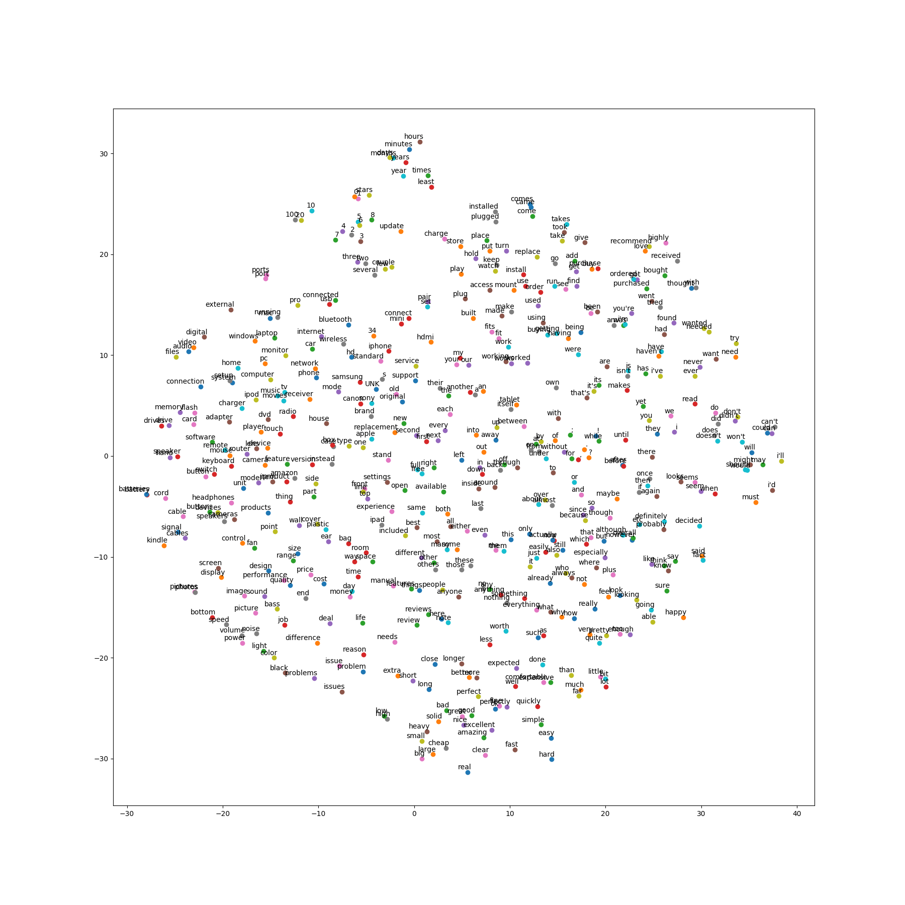

# CSE 842 Natual Language Processing Final Project

This repo are the source code and documents for the CSE 885 842 Natual Language Processing final project.

## Prediction of Amazon Review Helpfulness Using Deep Learning

We build a deep learning LSTM model to evaluate the helpfulness score of the Amazon customer product reviews. Such system helps the user to filter out those really helpful comments and reduce the time during product selection.

## Requirement

See "projectguidelines.pdf"

## Method and Results

Check the report and presentation slides in "docs" folder.

## Word2Vec

A figure that shows the PCA results of the word vectors after Word2Vec processing.

## About the Source Code

### Overview

Since two of the group members write their code seperately (but the data is shared), the source code consist of two parts. 

### Dataset:

Our dataset can be found at http://jmcauley.ucsd.edu/data/amazon/. Specifically, the 5-core electronics product customer review can be downloaded via: http://snap.stanford.edu/data/amazon/productGraph/categoryFiles/reviews_Electronics_5.json.gz

### Data preparation

The whole dataset file is about 1.3 GB. Since it is too large, we separate them into 26 chunks. For data chunking, set the "function_flag" variable to `1` in LSTM folder, "review_rnn_main.py", line 73, then run the code by

>> python review_rnn_main.py

Tips: you may need to specify the path to the data `.json` file first in "ReviewRNNProcessor.py".

### CNN

For the CNN part. Run the code simply by 

>> python train.py

It requires tensorflow to run.

### LSTM

For the LSTM classification part, set the "function_flag" in "review_rnn_main.py" to 2 and run the code by

>> python review_rnn_main.py

It requires `keras`, `numpy`, `scipy`, `h5py` etc. to run. If you want to load more data, change the number in the FOR loop. By default it only load the first chunk.

For LSTM regression part, set the "function_flag" in "review_rnn_main.py" to 3 and run.

To be honest, the LSTM code is still in debug mode, where I use many flags to control the function flow. I didn't simplified it to a one-shot library-like code. It is normal to encounter error when running the code for the first time, but it should be easy to fix.